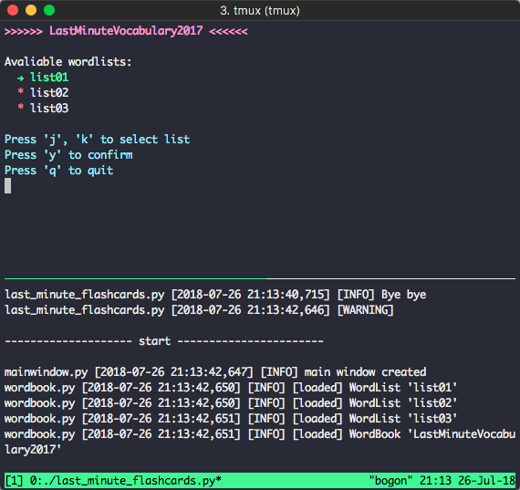
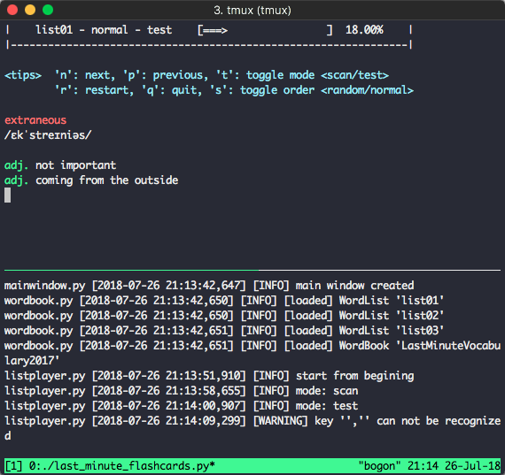

# LMF: Last Minute Flashcards for GRE Vocabulary

A command-line tool to learn GRE words with flashcards.

You can efficiently use fragmented working time to learn words with LMF:

- **Simple**: Only need an additional terminal pane to run, no need to switch between windows or desktops.
- **Quick launch**: Take use of every minute when you are training models, processing data, etc.
- **Mini**: Take tiny space, you can monitor the progress of running program simultaneously.


## Set Up

```sh
$ bash ./setup.sh
```

If you meet an encoding problem (encoding for stdout is not 'UTF-8'), please set the `PYTHONIOENCODING` environment variable by running the following line in your console:

```sh
export PYTHONIOENCODING=UTF-8
```

(You can also add this line to your `~/.bashrc` or `~/.profile` file and source it)


## Run

```sh
$ cd lmf
$ python last_minute_flashcards.py [-h] [-r]
```

```
optional arguments:
    -h, --help    show this help message and exit
    -r, --reload  reload the vocabulary
```


## Screenshots

Following are screenshots.

There are two panes in the tmux. 

LMF runs in the top pane. Bottom pane shows the log using command `tail -f log/lmf.log`




